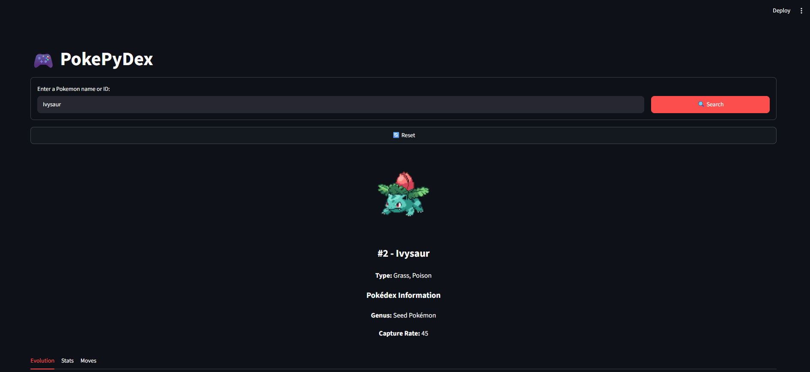
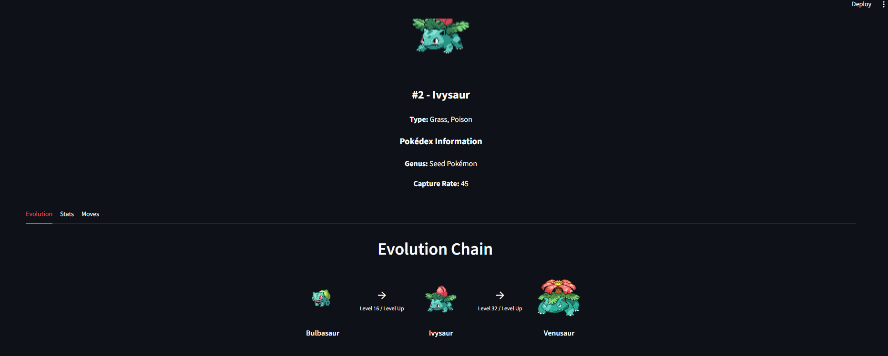
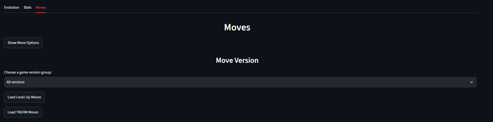
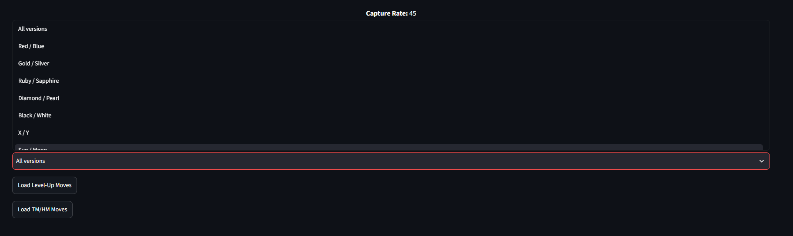
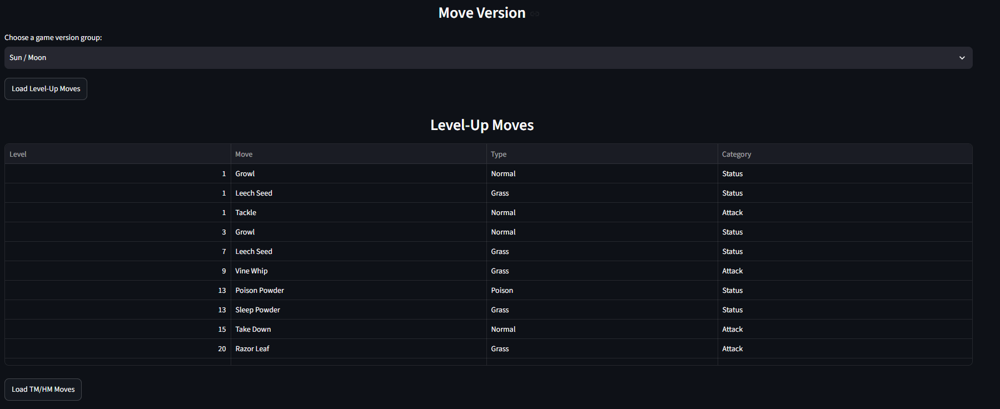
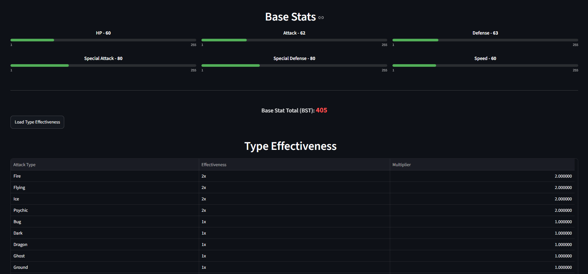

# PokePyDex

[](https://github.com/MattDSantosDev/pypokedexlibrary/actions/workflows/ci.yml)

PokePyDex is a Python client library and Streamlit application for exploring Pokemon data from the [PokeAPI](https://pokeapi.co/).

The project demonstrates:

- HTTP API integration with `requests`;
- input normalization for names, IDs, and common regional forms;
- error handling for missing Pokemon and API failures;
- cached API requests;
- evolution-chain processing, including branching chains;
- clickable evolution-chain navigation;
- level-up and TM/HM move tables filtered by game version;
- type-effectiveness calculations, including immunities and resistances;
- Pokémon-specific game-version availability;
- automated tests with `pytest`;
- an optional Streamlit frontend.

## Requirements

- Python 3.10 or newer;
- WSL with Python and `venv` installed;
- internet access for PokeAPI requests.

The project consumes the hosted PokeAPI. You do not need to install or run the PokeAPI server locally.

## Installation in WSL

From the project directory:

```bash
cd "/mnt/d/Estudo e Projetos/Projetos/pypokedexlibrary"
python3 -m venv .venv
source .venv/bin/activate
python -m pip install --upgrade pip
python -m pip install -e ".[app,test]"
```

The optional extras install:

- `requests` for API calls;
- `streamlit` and `pandas` for the frontend and tables;
- `pytest` for automated tests.

## Python Usage

The public API can be imported directly from `PokePyDex`:

```python
from PokePyDex import get_pokemon

pokemon = get_pokemon("pikachu")

print(pokemon["Name"])
print(pokemon["Types"])
print(pokemon["Stats"])
```

Identifiers may be names or numeric IDs:

```python
from PokePyDex import get_pokemon

get_pokemon("pikachu")
get_pokemon(25)
get_pokemon("Alolan Raticate")
```

Common regional names are normalized to identifiers recognized by PokeAPI. For example, `Alolan Raticate` becomes `raticate-alola`.

## Available Functions

| Function | Purpose |
| --- | --- |
| `get_pokemon(name_or_id)` | Returns basic Pokemon data, types, stats, and sprite URL. |
| `get_pokemon_species(name_or_id)` | Returns genus, capture rate, and legendary or mythical status. |
| `get_evolution_chain(name_or_id)` | Returns a display-friendly evolution tree with sprites and requirements. |
| `get_level_up_moves(name_or_id, version_group=None)` | Returns moves learned by leveling up, optionally filtered by game version. |
| `get_machine_moves(name_or_id, version_group=None)` | Returns TM/HM moves with type and category, optionally filtered by game version. |
| `get_type_effectiveness(name_or_id)` | Returns attack-type multipliers against the Pokémon, such as `2x`, `0.5x`, and `0x`. |
| `get_available_version_groups(name_or_id)` | Returns the game-version groups in which the Pokémon appears. |
| `normalize_identifier(name_or_id)` | Converts user input into a PokeAPI-compatible identifier. |

Move results use these categories:

- `Attack` for physical moves;
- `Special Attack` for special moves;
- `Status` for status moves.

## Errors

```python
from PokePyDex import (
    PokeAPIError,
    PokemonNotFoundError,
    get_pokemon,
)

try:
    pokemon = get_pokemon("missingno")
except PokemonNotFoundError:
    print("Pokemon was not found")
except PokeAPIError:
    print("PokeAPI could not be reached")
```

`PokemonNotFoundError` indicates that the identifier does not match a resource. `PokeAPIError` indicates a network, server, or invalid-response problem. Empty input raises `ValueError`.

## Streamlit Application

Start the frontend from the project root with the virtual environment active:

```bash
streamlit run PokePyDex/streamlit_app.py
```

Open the local URL shown in the terminal, usually:

```text
http://localhost:8501
```

The app displays basic information, species data, evolution chains, base stats, type effectiveness, and optional move tables. Evolution sprites are clickable and open the selected Pokémon. Move data is lazy-loaded: first choose **Show Move Options**, then choose an available game version and load either the Level-Up or TM/HM table. This keeps the initial search faster.

## Testing

Run the complete test suite:

```bash
python -m pytest -q
```

Compile the Python modules without running the application:

```bash
python -m py_compile PokePyDex/myfunctions.py PokePyDex/streamlit_app.py
```

Tests mock HTTP requests where appropriate, so the test suite does not depend on live PokeAPI responses.

## Project Structure

```text
PokePyDex/
	__init__.py          Public package interface
	myfunctions.py       API client and data processing
	streamlit_app.py     Streamlit frontend
tests/
	test_myfunctions.py  Automated tests
assets/                  README preview images
.github/workflows/       GitHub Actions CI workflow
pyproject.toml            Package metadata and dependencies
setup.py                 Legacy packaging compatibility
README.md                Project documentation
```

## Data Source

Pokemon data is provided by [PokeAPI](https://pokeapi.co/). This project is an independent client and is not affiliated with PokeAPI, Nintendo, or The Pokemon Company.

PokeAPI requests are read-only. The project uses caching and should make requests responsibly according to the PokeAPI fair-use guidance.

## License

This project is licensed under the MIT License. See [LICENSE](LICENSE).


## Preview






